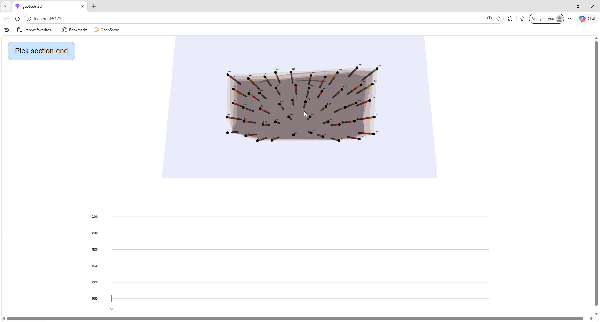

# Geotech 3D

A web-based 3D visualization tool for geotechnical engineers to model boring data, interpolate subsurface layers, and generate dynamic cross sections.

## 🚀 Features

* 3D boring visualization with layered soil profiles
* Interpolated subsurface surfaces (Sand, Clay, Gravel, Rock)
* User-defined section line
* Real-time 2D cross section generated from 3D surfaces
* Handles disappearing soil layers (pinch-out logic)

## 📸 Demo



## 🛠 Tech Stack

* React + TypeScript
* Three.js (via @react-three/fiber)
* Delaunay triangulation for surface generation

## 🧠 Core Concept

Soil boundaries are modeled as interpolated 3D surfaces.
A section line samples these surfaces to generate accurate 2D profiles.

## ▶️ Running Locally

```bash
npm install
npm run dev
```

## 📌 Future Improvements

* Interactive boring input UI
* Multiple section lines
* Export to PDF / CAD
* Real GIS coordinate support

---

Built by Austin Guter
